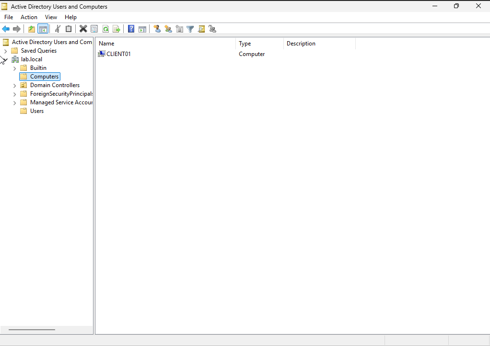
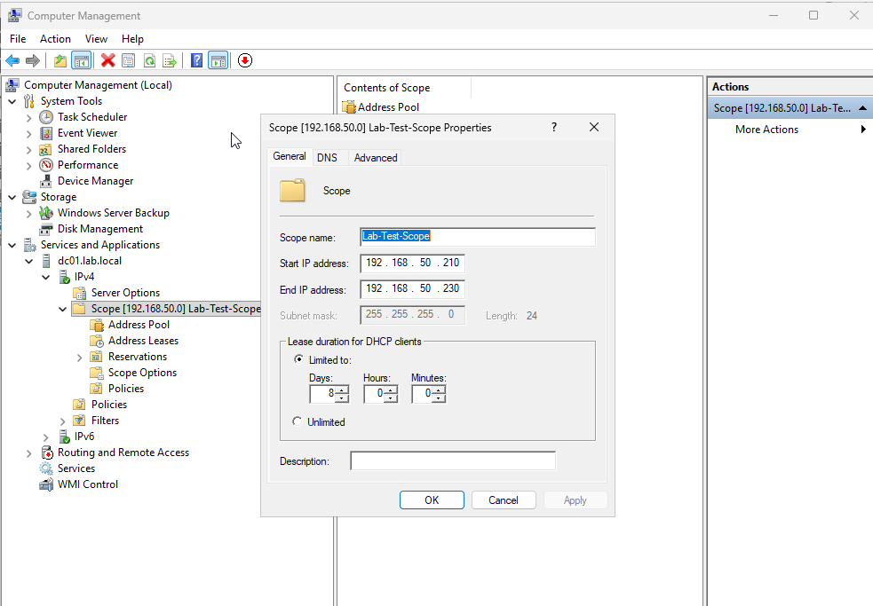
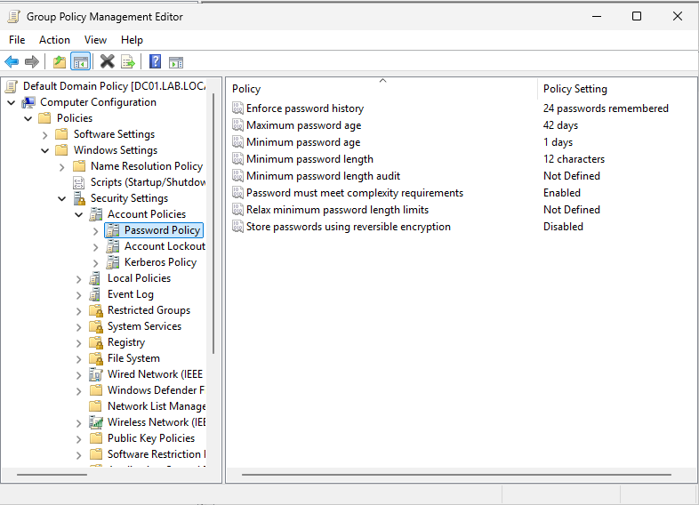
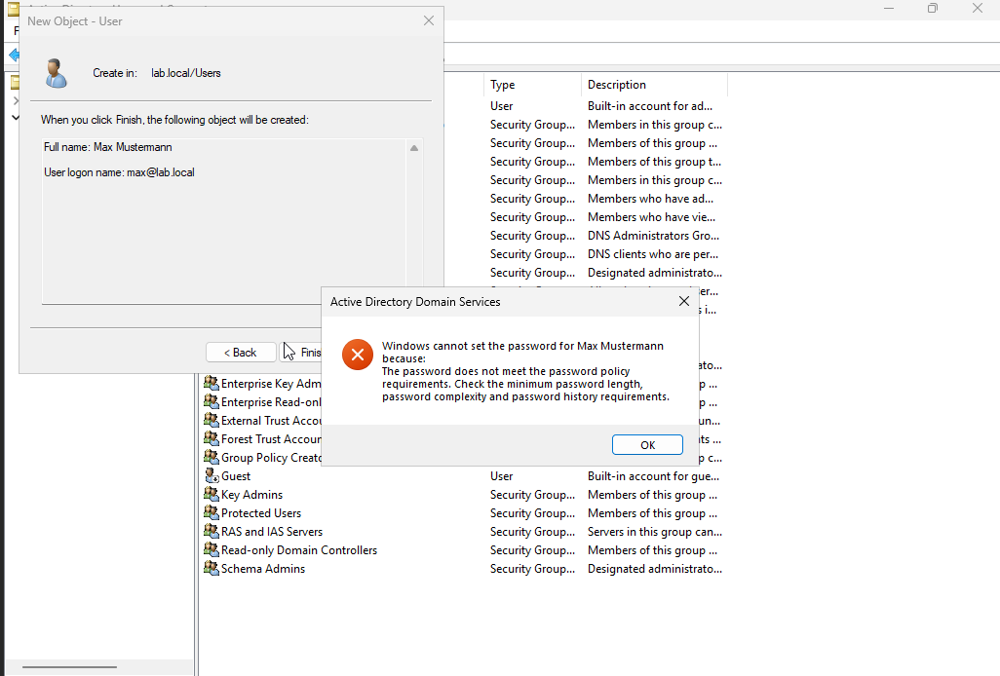

🇩🇪 [Deutsche Version](README.de.md)

# Windows Server 2025 Lab Environment — Active Directory, DNS, DHCP, Group Policy & Delegated Administration

## Overview

This project documents a self-built Windows Server 2025 lab environment, deployed as a virtual machine on a self-hosted Debian home server. The goal was to gain hands-on, practical experience with core Windows Server administration tasks — Active Directory Domain Services, DNS, DHCP, and Group Policy — in a realistic, network-integrated setup rather than an isolated sandbox.

## Environment

- **Host:** Debian server, AMD Ryzen 5 3500X, 16 GB RAM
- **Hypervisor:** KVM/QEMU with libvirt, managed via `virsh` and `virt-install`
- **Guest OS (Domain Controller):** Windows Server 2025 Standard (Evaluation), Desktop Experience — 4 GB RAM, 2 vCPUs
- **Guest OS (Client):** Windows 10 Pro — 2 GB RAM, 2 vCPUs
- **Networking:** libvirt macvlan network, giving each VM a real IP address on the home LAN (rather than NAT), so the domain controller and client interact exactly as they would on a physical network segment
- **Driver note:** Windows does not ship with a built-in VirtIO network driver by default on Windows 10/11 clients; this was resolved by attaching the official [virtio-win](https://github.com/virtio-win/virtio-win-pkg-scripts) driver ISO as a second virtual CD-ROM and installing the NetKVM driver via Device Manager.

## What was implemented

- **Active Directory Domain Services (AD DS):** Deployed a new forest and domain (`lab.local`), promoted the server to a domain controller.
- **DNS:** Installed alongside AD DS, hosting the domain's own forward lookup zone; verified name resolution from a domain-joined client.
- **DHCP:** Configured a dedicated scope, carefully sized and separated from the existing router's DHCP pool to avoid address conflicts on the home network. Authorized the DHCP server in Active Directory and confirmed a client successfully obtained a lease from it.
- **Domain join:** Joined a Windows 10 client VM to the domain and confirmed authentication with a domain account.
- **Group Policy (GPO):** Modified the Default Domain Policy's password policy (minimum length raised from 7 to 12 characters) and verified enforcement by attempting to create a new AD user with a non-compliant password, which was correctly rejected.
- **Organizational Units & delegated administration:** Built an OU structure (`IT`, `Sales`) with test users in each, then created a non-admin `sales.support` account and used the Delegation of Control Wizard to grant it password-reset rights scoped **only** to the Sales OU. Verified the principle of least privilege in practice: password resets succeeded in Sales, but were correctly denied ("Access is denied") when attempted against a user in the IT OU. Also discovered that "Reset Password" and "Unlock Account" are separate delegable rights — the delegated account could reset passwords but was denied when attempting to unlock a locked-out account, since that right hadn't been separately granted.
- **File Server & NTFS permissions:** Created security groups (`Sales-Team`, `IT-Team`) mapped to the OU structure, set up a shared folder with per-department subfolders, and configured share-level plus NTFS-level permissions so each group can only access its own subfolder. Verified with both test accounts that access is correctly granted or denied depending on group membership.
- **GPO-based drive mapping:** Used Group Policy Preferences (User Configuration → Drive Maps) with item-level targeting to automatically map a network drive to the correct department share based on security group membership — `Sales-Team` members get an `S:` drive, `IT-Team` members get an `I:` drive, with no manual configuration needed on the client.

## Screenshots

*(Additional screenshots for OU/delegation, NTFS permissions, and GPO drive mapping to be added.)*

## Real-world troubleshooting notes

**Network bridge outage.** Midway through setting up a network bridge for the VMs, the host's primary network interface briefly became unreachable after a `systemctl restart networking`. Rather than treating this as a blocker, it became a useful exercise in incident response:

- A scheduled rollback job (`at`) had been prepared in advance as a safety net before making the network change
- When the server didn't come back on the expected address, the router's client list and ARP behavior were used to locate it under a different DHCP-assigned IP
- Root cause was traced to a misconfigured system timezone (6-hour offset), which had also caused confusion around the scheduled rollback timing
- Ultimately, a safer **macvlan** network was used instead of a full bridge, avoiding any further changes to the host's primary interface

**DHCP race condition.** With two DHCP servers active on the same network segment — the home router and the new Windows DHCP server — a domain-joined client occasionally received a lease from the wrong one, since either server could answer a `DHCPDISCOVER` first. This was resolved by assigning a static IP to the domain-joined test client, and served as a practical reminder that a single network segment should generally only have one authoritative DHCP server unless traffic is explicitly separated (e.g. via DHCP relay to another subnet).

Both incidents were good demonstrations of methodical troubleshooting under partial outages, rather than just following a checklist.

## Skills demonstrated

- Linux server administration (Debian, systemd, networking, firewall/UFW)
- KVM/QEMU virtualization and libvirt management
- Windows Server 2025 installation and configuration
- Active Directory Domain Services, DNS, DHCP administration
- Group Policy Object creation, Group Policy Preferences, and item-level targeting
- Organizational Units, security groups, and delegated administration (least privilege)
- File server setup with share and NTFS permission layering
- Network troubleshooting and incident recovery
